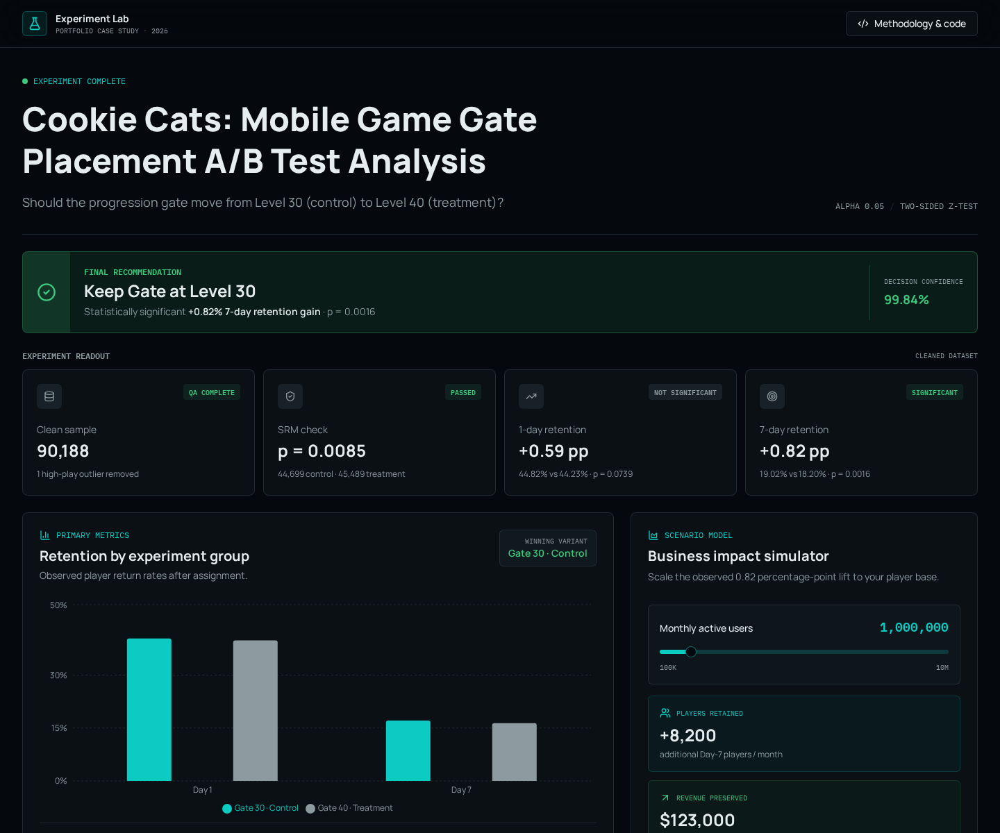

# Cookie Cats A/B Testing & Data Analytics Dashboard

An interactive portfolio analysis of whether Cookie Cats should move its progression gate from Level 30 to Level 40.



## Highlights

- Executive recommendation based on 90,188 cleaned player records
- One-day and seven-day retention comparison
- Sample-ratio mismatch and two-sample Z-test results
- Interactive monthly active user and revenue-impact simulator
- Downloadable dataset and complete Python analysis

## Build with Lovable

Open your project in the [Lovable editor](https://lovable.dev) and keep building.

- **Ship faster**: describe what you want to build and Lovable handles the code.
- **Stay in sync**: connect the project to GitHub and every change made in Lovable is committed straight to your repository.
- **Full ownership**: this code is yours. Push to your repository and your changes sync back into Lovable, ready for your next prompt.

## Development

Prefer working locally? You need Node.js and npm — [install with nvm](https://github.com/nvm-sh/nvm#installing-and-updating).

```sh
git clone <this-repository-url>
cd <repository-name>
npm i
npm run dev
```

## Built with

- TanStack Start
- TypeScript
- React
- Tailwind CSS
